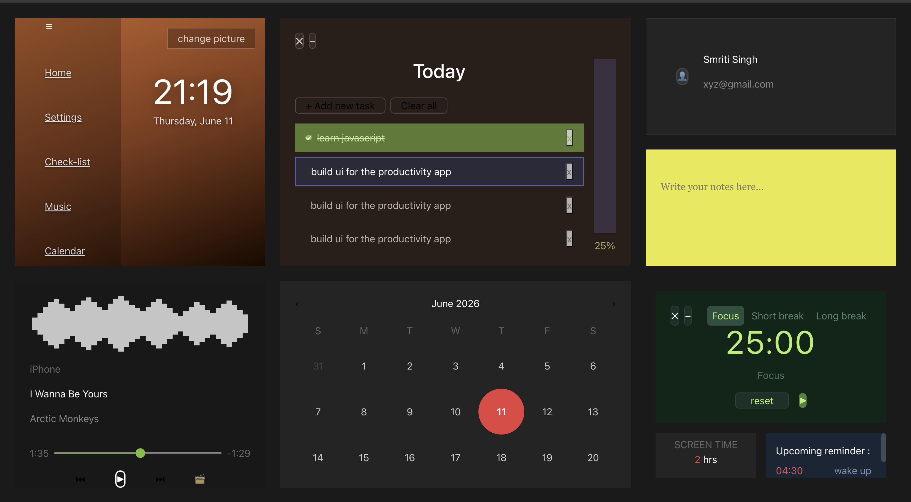

# FocusDock

FocusDock is a React-based productivity dashboard that brings your essential planning tools into a single workspace. It combines task tracking, time management, notes, music, and personalization features in a clean, modern interface.


This project is a work in progress. Improvements and new productivity modules are planned over time.
Feel free to contribute!

## Features

- ✅ To-do list for task management
- ⏱️ Pomodoro timer for focused work sessions
- 🗒️ Sticky note component for quick note-taking
- 🎧 Focus music player area
- 📅 Calendar overview for schedule context
- 🖼️ Wallpaper / theme personalization panel
- ⏳ Screen time tracker and reminder preview
- 👤 Profile card placeholder for user context





## Built With

- React 19
- Vite
- Tailwind CSS
- Bootstrap Icons
- JavaScript

## Getting Started

### Prerequisites

- Node.js 18+ or compatible version
- npm or yarn

### Install

```bash
npm install
```

### Run Locally

```bash
npm run dev
```

Open the URL shown in the terminal to view the app in your browser.

### Build for Production

```bash
npm run build
```

## Project Structure

- `src/App.jsx` — app entry point
- `src/components/Grid.jsx` — dashboard layout and card placement
- `src/components/Wallpaper.jsx` — wallpaper and theme panel
- `src/components/Todo.jsx` — task management panel
- `src/components/Note.jsx` — sticky notes panel
- `src/components/Music.jsx` — focus music panel
- `src/components/Calendar.jsx` — calendar overview panel
- `src/components/Pomodoro.jsx` — Pomodoro timer panel


